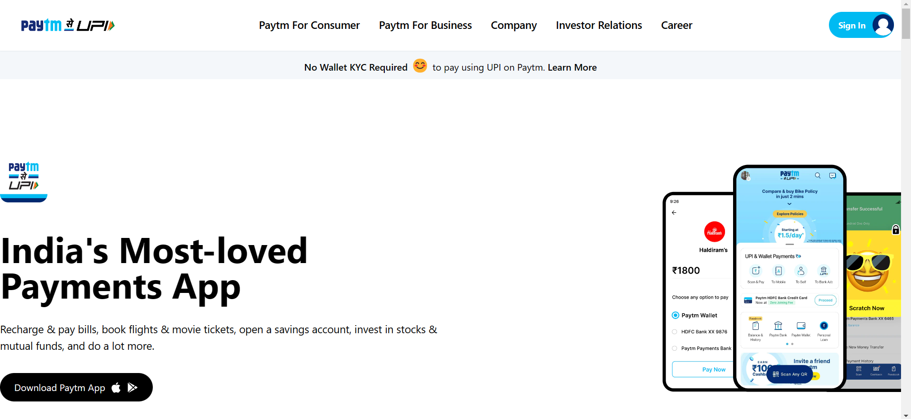

# Project ( Paytm-HomePage-Clone )
[Live-In-Production Demo](https://spectacular-clafoutis-21474f.netlify.app/)_________________________________________ _Individual Project | Duration: 10-11 hours  
- In this project cloned paytm.com home-webpage using html and tailwind css. 
- All pictures and assets are from paytm official and using pure tailwind css (Mobile Responsive).

## 👨‍💻 Tech Stack
Tech : `HTML` `TailWindCSS`  

Tools : `VS Code`

## 📝 I Learn
- HTML tags & TailWind CSS basics and classes

## 📷 Screenshot

### Pc:

